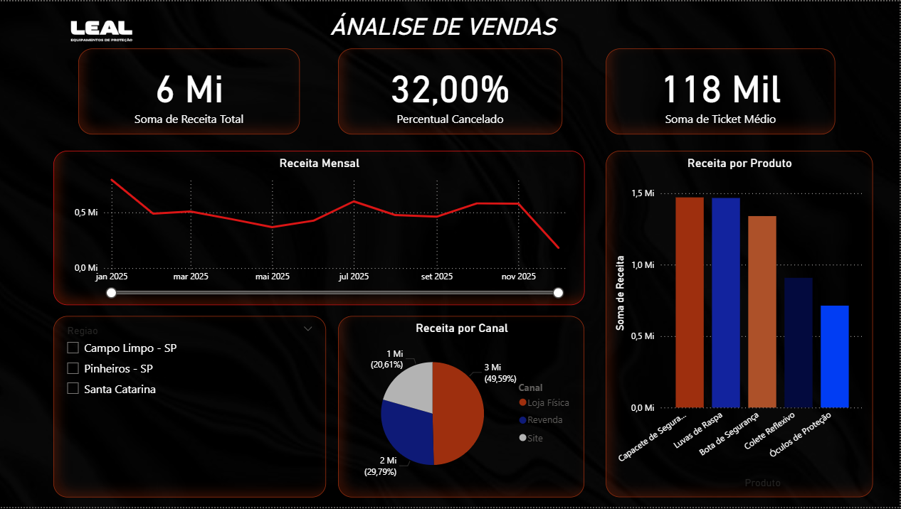

# Análise de Vendas — Leal Equipamentos de Proteção👷🏼

 Projeto de portfólio com dados fictícios da empresa Leal. O objetivo é limpar e explorar dados de vendas, responder perguntas de negócio com SQL e apresentar os resultados em um dashboard no Power BI.



## Objetivos
```
- Ingestão e limpeza de um arquivo CSV de vendas.
- Transformações básicas para padronização de tipos, títulos e remoção de duplicidades.
- Carga no MySQL e consultas SQL para responder perguntas de negócio.
- Construção de dashboard no Power BI com KPIs e visualizações principais.
```
## Stack e Arquitetura
````
- Python (pandas, sqlalchemy) para leitura e limpeza de dados.
- MySQL como banco relacional para consultas.
- SQL para responder as perguntas de negócio.
- Power BI para visualização.
`````
## Fluxo resumido:
````
CSV (dados brutos) → Python (limpeza) → CSV limpo + MySQL → SQL (consultas) → Power BI (dashboard)
````
## Estrutura do Repositório
````
PROJETO.LEAL/
├─ Dados/
│  ├─ vendas_leal_sujo.csv
│  └─ vendas_leal_limpo.csv
├─ imagens/
│  └─ dahsboard.png                 # print do dashboard
├─ PowerBI/
│  └─ projeto leal.pbix             # arquivo do relatório
├─ SQL/
│  └─ consultas.sql                 # todas as queries comentadas
├─ Receita total.csv                # resultados exportados (quando aplicável)
├─ Ticket medio.csv
├─ Receita Regiao.csv
├─ Receita Canal.csv
├─ Receita Mensal.csv
├─ Porcentagem cancelados.csv
├─ produtos mais vendidos.csv
├─ projeto.leal.ipynb               # notebook de limpeza/ETL simples
└─ README.md                        # este arquivo
````
## Dataset

## Fonte: arquivo fictício vendas_leal_sujo.csv
Campos principais:
````
id_pedido
````
````
data
````
````
cliente
````
````
produto
````
````
canal (Loja Física, Revenda, Site)
````
````
mercado
````
````
status (Aprovado, Cancelado)
````
````
valor
````
````
regiao (Campo Limpo - SP, Pinheiros - SP, Santa Catarina)
````
## Limpeza aplicada (resumo)

No projeto.leal.ipynb:
```python
pd.to_datetime(df['data'], errors='coerce')

pd.to_numeric(df['valor'], errors='coerce')

df.drop_duplicates(subset=['id_pedido'])

#Padronização de títulos de colunas:
df.columns = df.columns.str.strip().str.title()
```
Resultado salvo em Dados/vendas_leal_limpo.csv.

## **Query (MySQL):** 

***Pergunta 1:*** Qual a Receita Total da empresa?
```sql
SELECT ROUND(SUM(valor), 2) AS 'Receita Total'
FROM vendas_leal;
```
✅ Resposta: A receita total foi de aproximadamente R$ 59 mil.
📊 Insight: Esse número consolida todas as vendas e serve de base para análises detalhadas.

***Pergunta 2:*** Qual o Ticket Médio dos pedidos?
```sql
SELECT ROUND(AVG(valor), 2) AS 'Ticket Médio'
FROM vendas_leal;
````

✅ Resposta: O ticket médio foi de cerca de R$ 1.180.
📊 Insight: Mostra o valor médio gasto por cliente. Ajuda a definir metas de upsell e estratégias de precificação.

***Pergunta 3:*** Qual o Percentual de Cancelados?
```sql
SELECT 
  ROUND(100.0 * SUM(CASE WHEN status = 'Cancelado' THEN 1 ELSE 0 END) / COUNT(*), 2) 
  AS 'Percentual Cancelados'
FROM vendas_leal;
```

✅ Resposta: Aproximadamente 32% dos pedidos foram cancelados.
📊 Insight: É um percentual alto. Precisa investigar causas: problemas logísticos, atendimento ou precificação.

***Pergunta 4:*** Qual a Receita por Região?
```sql
SELECT Regiao, ROUND(SUM(valor), 2) AS 'Receita Região'
FROM vendas_leal
GROUP BY Regiao
ORDER BY 2 DESC;
```

✅ Resposta: Santa Catarina e Pinheiros-SP lideram em receita; Campo Limpo-SP tem menor desempenho.
📊 Insight: Ações comerciais devem focar em Campo Limpo-SP para aumentar participação.

***Pergunta 5:*** Qual a Receita por Canal de Venda?
```sql
SELECT Canal, ROUND(SUM(valor), 2) AS 'Receita Canal'
FROM vendas_leal
GROUP BY Canal
ORDER BY 2 DESC;
```

✅ Resposta: A Loja Física representa quase metade da receita.
📊 Insight: É preciso investir em canais digitais (site, revenda) para diversificar e reduzir dependência.

***Pergunta 6:*** Qual a Receita por Mês?
```sql
SELECT DATE_FORMAT(data, '%Y-%m') AS Mes,
       ROUND(SUM(valor), 2) AS 'Receita Mensal'
FROM vendas_leal
GROUP BY Mes
ORDER BY Mes;
```

✅ Resposta: Há oscilações ao longo dos meses, com alguns picos e quedas.
📊 Insight: Identifica sazonalidade. Permite planejar campanhas em meses de baixa e reforçar estoque nos meses de alta.

***Pergunta 7:*** Quais são os Produtos Mais Vendidos?
```sql
SELECT Produto, ROUND(SUM(valor), 2) AS Receita
FROM vendas_leal
GROUP BY Produto
ORDER BY Receita DESC;
```

✅ Resposta: Luvas de Raspa e Capacetes de Segurança lideram em receita.
📊 Insight: Produtos de maior saída precisam ter estoque garantido e podem puxar cross-sell com itens de menor giro.

## Principais Métricas (KPIs)
```bash
Receita Total: 58.987,99

Ticket Médio: 1.179,76

% Cancelados: 32,00%
```
Valores conforme o conjunto de dados fictício desta versão.
